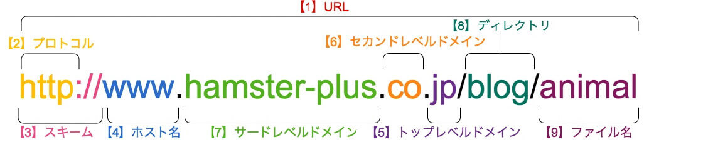

_________________________________________________
_________________________________________________
_________________________________________________
<https://ferret-plus.com/8736>  
　  
  
　  
  

_________________________________________________
_________________________________________________
_________________________________________________
<https://www.cman.jp/network/term/url/>  
　  
  
　  

## URLとURIの違い
  

#### URI(Uniform Resource Identifier)
「URL」「URN」の総称

#### URL(Uniform Resource Locator)
ネットワーク上の場所を示す  
インターネットで表示するページの場所（アドレス）など  
「住所」で例えられます  

#### URN(Uniform Resource Name)
名称を示す  
ネットワークに繋がっていなくても一意で永続的な識別  
「名前」に例えられます  

_________________________________________________

