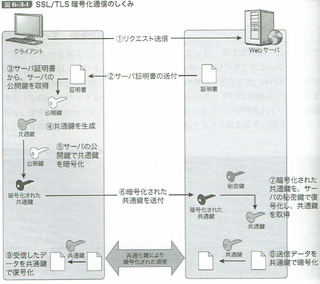

## SSL


```
・SSH：公開鍵認証
・SSL：共通鍵認証


## 公開鍵認証  
公開鍵で暗号化したファイルは、秘密鍵でしか復号できない。
秘密鍵で暗号化したファイルは、公開鍵でしか復号できない。

サーバに公開鍵を設置し、クライアントは秘密鍵を保持する
http://knowledge.sakura.ad.jp/beginner/3543/

## 共通鍵
クライアントとサーバ間で、共通を鍵を保持する


## OpenSSL
SSLとTLSの機能を実装したオープンソースライブラリ
```


