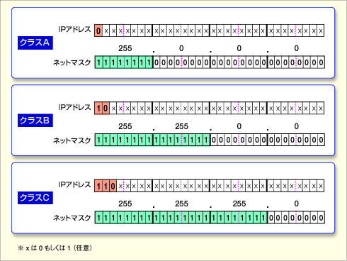

## IPアドレスとクラス
<https://kakisoft.github.io/MiscellaneousDocs/InfraAndEnv_Tool_Service/NetworkNote/IP-class/>  

ネットワークアドレス部とホストアドレス部に分けられる。   

管理の簡素化  
トラフィックの局所化  

## クラス

#### ネットワーク部：ホスト部
ネットワーク・アドレス部を長くするとホスト・アドレス部が短くなり、  
ネットワーク・アドレス部を短くすると、ホスト・アドレス部が長くなる。  

 * ネットワーク数を増やし、ホストの数を減らす
 * ネットワーク数を減らし、ホストの数を増やす

どちらかを選択する。  

### クラスA
最上位の1bitが「0」なら、そのIPアドレスは「クラスA」となる。  
具体的には「0.0.0.0～127.255.255.255」が該当する。

### クラスB
最上位の2bitが「10」なら、そのIPアドレスは「クラスB」となる。  
具体的には「128.0.0.0～191.255.255.255」が該当する。  

### クラスC
最上位の3bitが「110」なら、そのIPアドレスは「クラスC」となる。  
具体的には「192.0.0.0～223.255.255.255」が該当する。  

### クラスD
マルチキャスト通信で使われる特別なIPアドレス。  
マルチキャスト通信を使ったマルチメディア・アプリケーションなどで使われる。（同じ内容の音声や映像データなどをいっせいに「放送」するような用途など）  
一般的なノードにクラスDのIPアドレスだけを付けることはない。  

### クラスE
「実験的」な目的のためにTCP/IP（IPv4）の開発当初から予約されており、実際に使われることはない。

### プライベートアドレス

|  クラス   | 範囲                                             | ネットワーク数  |
|:---------|:-------------------------------------------------|----------------|
|  クラスA  |  10.0.0.0 ~ 10.255.255.255 (10.0.0.0/8)	       |  1             |
|  クラスB  |  172.16.0.0 ~ 172.31.255.255 (172.16.0.0/12)	   |  16            |
|  クラスC  |  192.168.0.0 ~ 192.168.255.255 (192.168.0.0/16)  |  256           |

0000 1010  
0000 1010  

1010 1100 0001 0000  
1010 1100 0010 0000  

1100 0000 1010 1000  
1100 0000 1010 1000  

## デフォルト・ネットマスク
クラスAからクラスCまでのアドレス・クラスでは、デフォルトのネットマスクの値（＝ネットワーク・アドレスとホスト・アドレスを分けるためのマスク値）が決まっている。  

### クラスA
ネットマスクの値は「255.0.0.0」となる。  
IPアドレスは、1byteのネットワーク・アドレス部と3bytesのホスト・アドレス部に分けられる。  

クラスAでは、IPアドレスの最上位bitは常に「0」固定なので、ネットワーク・アドレスとしては、「0～127」までの全部で128個が利用でき、それぞれのネットワーク内には最大でそれぞれ約1600万台（0.0.0～255.255.255）のホストを収容できる。  

### クラスB
ネットマスクの値は「255.255.0.0」となる。  
IPアドレスは、2bytesのネットワーク・アドレス部と2bytesのホスト・アドレス部に分けられる。  

クラスBでは、IPアドレスの最上位の2bitは常に「10」に固定なので、ネットワーク・アドレスとしては、「128.0～191.255」までの全部で1万6384個が利用でき、それぞれのネットワーク内には最大でそれぞれ約6万5000台（0.0～255.255）のホストを収容することができる。  

### クラスC
ネットマスクの値は「255.255.255.0」となる。  
この結果IPアドレスは、3bytesのネットワーク・アドレス部と1byteのホスト・アドレス部に分けられる。  

クラスAでは、IPアドレスの最上位の3bitは常に「110」に固定なので、ネットワーク・アドレスとしては、「192.0.0～223.255.255」までの全部で約200万個が利用でき、それぞれのネットワーク内には最大でそれぞれ約250台（0～255）のホストを収容することができる。  

__________________________________________________________________
# サブネット（サブネット分割） : CIDR（Classless Inter-Domain Routing）　: クラスレスアドレッシング
ユーザー自身が自由にネットワーク・アドレスとホスト・アドレスを決定できるようにできる。  

